<div align="center">

<a href="https://loop.sv-academy.org">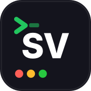</a>

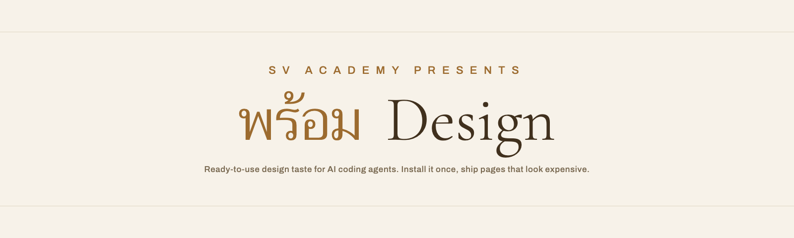

**Your AI ships pages that look expensive. Starting today.**

*พร้อม, prom, is Thai for ready. Ready as in: the taste is already in the
file. This is the house-style skill a working studio runs on real client
sites, installable by anyone in one command. It asks what you are making,
offers you the Prom take, and builds mobile-first. You never need to know
design; you only need to recognize which version you like.*

</div>

---

## The 50 millisecond problem

People form a verdict on your page in about 50 milliseconds, and they rarely
revise it (Lindgaard et al., 2006). Stanford's Web Credibility Project found
roughly 75% of users judge an organisation's credibility by its visual design
(Fogg, 2002). Your product gets judged before anyone reads a word of it.

AI coding agents make this worse, because they all default to the same look:
the purple gradient, the emoji card grid, the rounded pill button, copy that
promises everything and proves nothing. Everyone can see it now. It has a
name: **AI slop.**

Same brand. Same one-line request. One difference: the skill.

| Without | With Prom Design |
|:---:|:---:|
| 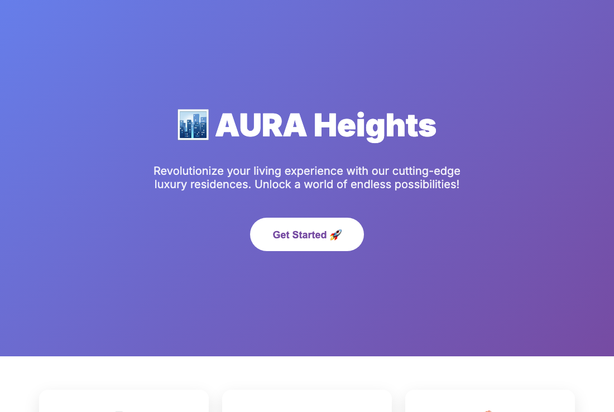 | 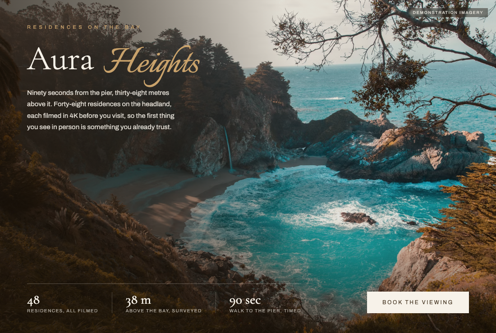 |
| The purple gradient special | Tinted ground, one serif, proof over promise |

## Install once

The universal way, verified on 19+ agents including Claude Code and Cursor:

```bash
npx skills add sva-admin/sv-academy-prom-design
```

Or as a Claude Code plugin:

```bash
claude plugin marketplace add sva-admin/sv-academy-prom-design
claude plugin install prom-design@sv-academy-prom-design
```

**Claude Cowork:** zip `skills/prom-design/` and upload it as a skill.

Never installed a skill before? **[GETTING-STARTED.md](GETTING-STARTED.md)**
walks you from zero to your first page in five minutes. And every demo below
is a real page you can open live:
**[sva-admin.github.io/sv-academy-prom-design](https://sva-admin.github.io/sv-academy-prom-design/)**

## Then run it on YOUR page

Do not take the gallery's word for it. The only demo that matters is your own
project:

```
Apply the prom-design skill to this page. Show me before and after, and name
every rule you applied.
```

The diff is the sales pitch. If you do not like what you see, uninstall it,
nothing else changed.

## Walk through a whole product, not a screenshot

The strongest proof is clickable. Two complete fictional experiences, every
page built by the skill and holding at any width:

- **[AURA Heights, the full 5-page site](https://sva-admin.github.io/sv-academy-prom-design/demo/aura/index.html)**: home, residences, a filmed residence, the headland, booking. Cinematic register.
- **[The Assembly, the full 5-screen app](https://sva-admin.github.io/sv-academy-prom-design/demo/assembly/events.html)**: events, detail, tonight, membership, join. Instrument register with a bottom tab bar.

## What it does to real work

Every "without" below is a look you have shipped or seen shipped. Every
"with" is the SAME site transformed: same sections, same facts, same
purpose, redesigned by the skill. That is the honest test, and it is also
exactly what the skill does to your existing pages. Nothing here is a
mockup of a real client; all brands are invented so the rules can be shown at
full specificity.

**A restaurant.** The emoji card grid, versus a room you can almost smell.

| Without | With Prom Design |
|:---:|:---:|
| 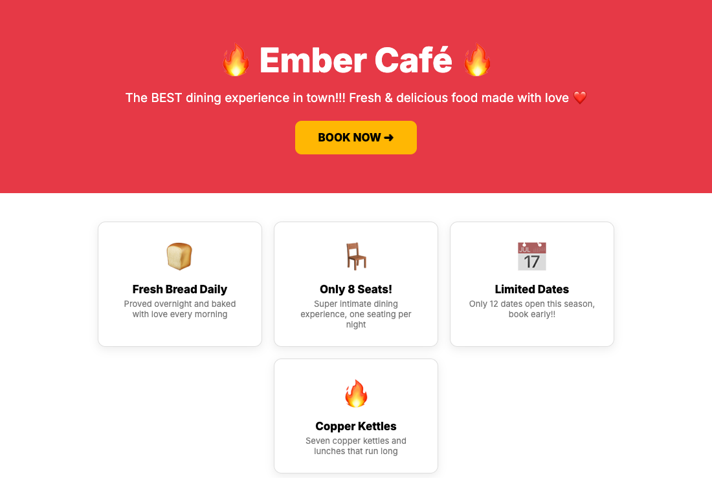 | 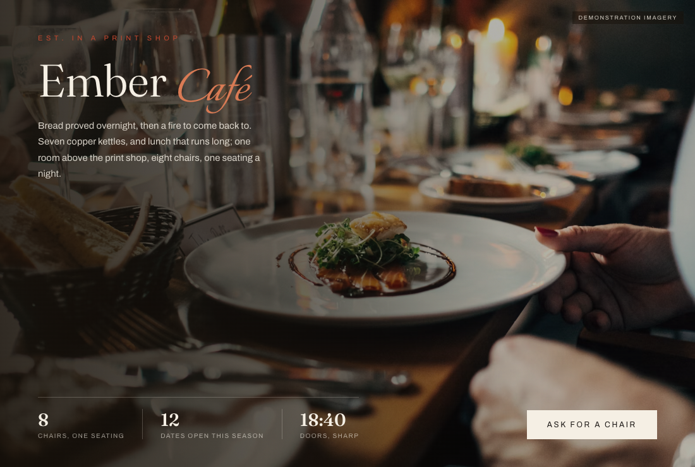 |
| "The BEST dining experience in town!!!" | Eight chairs, one seating, doors 18:40 sharp |

**A SaaS dashboard.** The same five invoices twice: the admin-panel special,
versus an instrument you could run a business on.

| Without | With Prom Design |
|:---:|:---:|
| 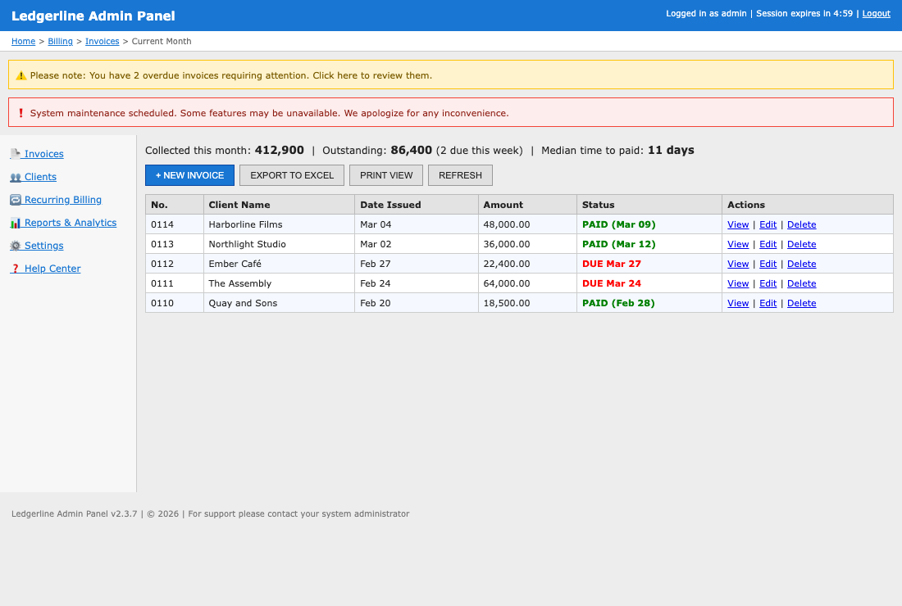 | 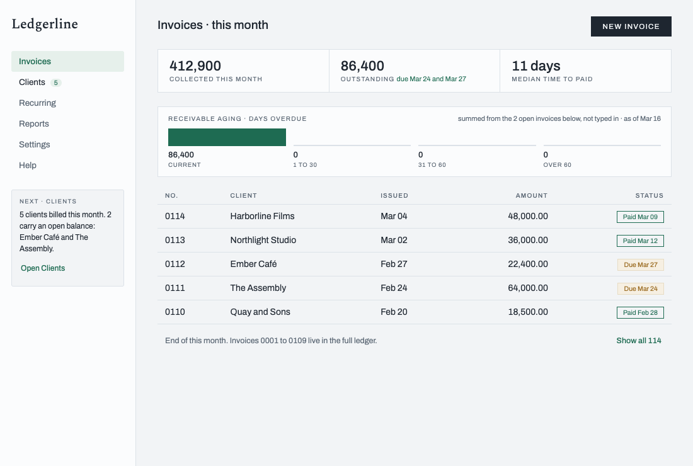 |
| Alert banners, Verdana, Delete links | 412,900 collected, 2 due this week, tabular numerals |

**A portfolio.** The my-first-website special, versus a page that costs what
your work costs.

| Without | With Prom Design |
|:---:|:---:|
| 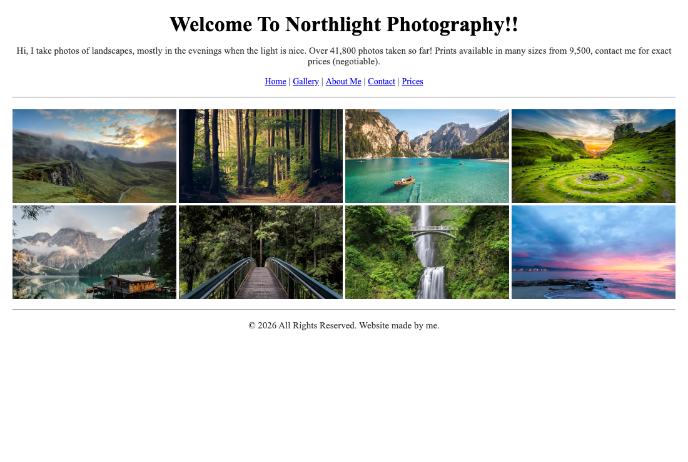 | 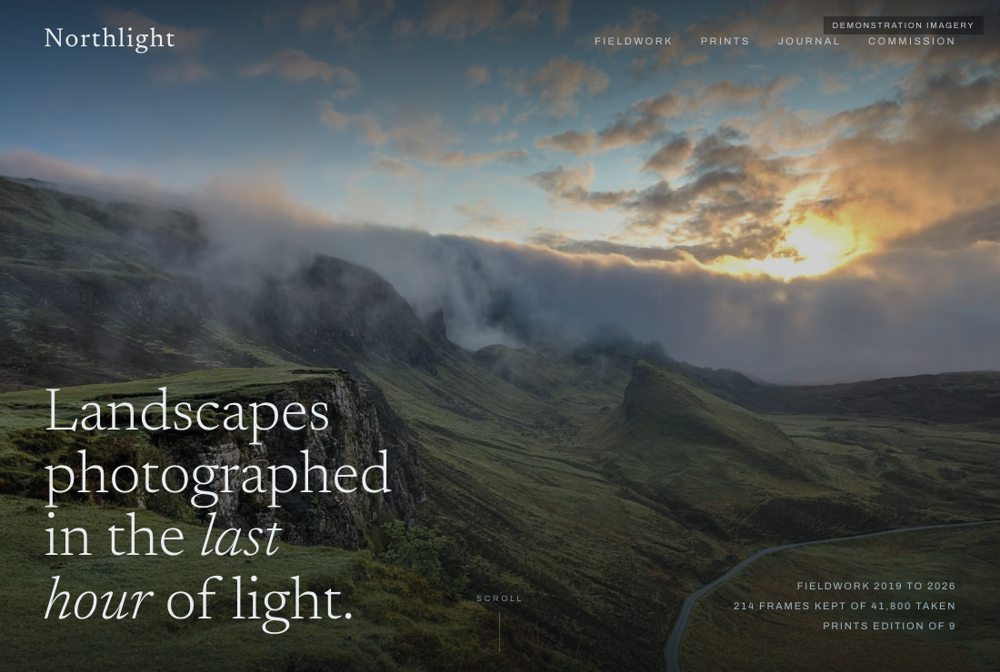 |
| Centered Times, blue links, crammed grid | One photograph, one serif, 214 frames kept of 41,800 |

**A florist in a rainy hill town.** The same shop twice, section for
section: three services, the weekly jar at 340 a month, the testimonial, the
hours. Hot-pink template slop versus the same flowers taken seriously.

| Without | With Prom Design |
|:---:|:---:|
| 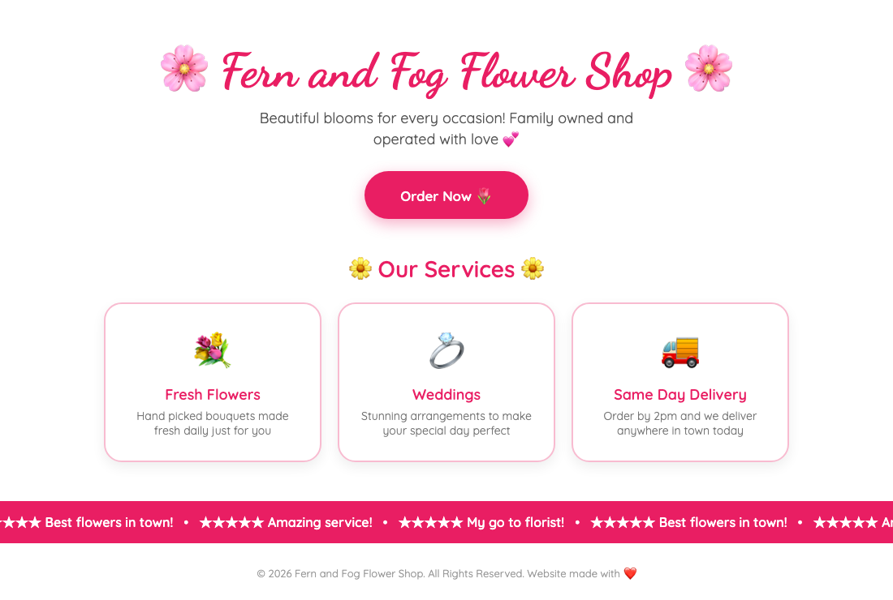 | 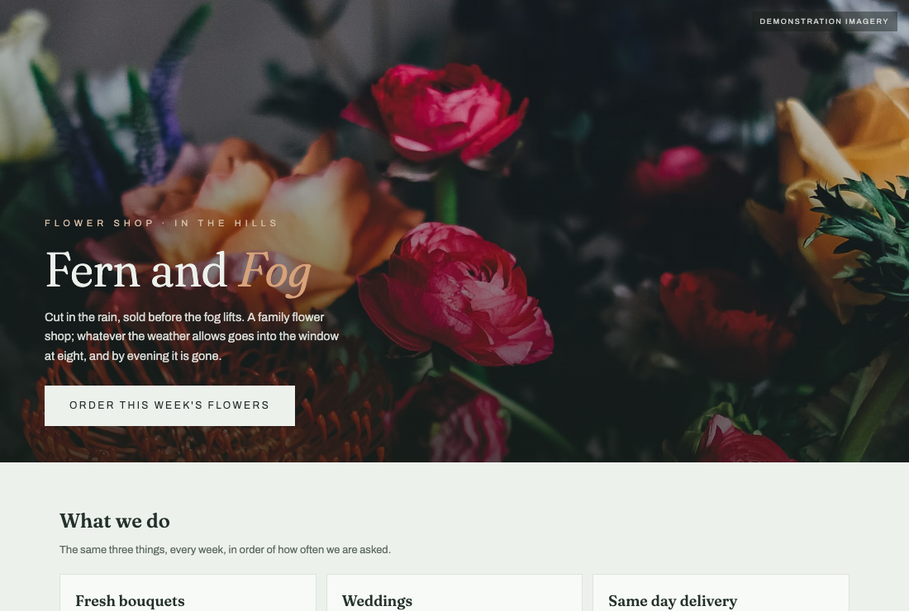 |
| Dancing Script, emoji, star marquee | Rain-glass green, evidence, one quoted subscriber |

**A mobile web app.** Link soup, versus seats you can count.

<div align="center">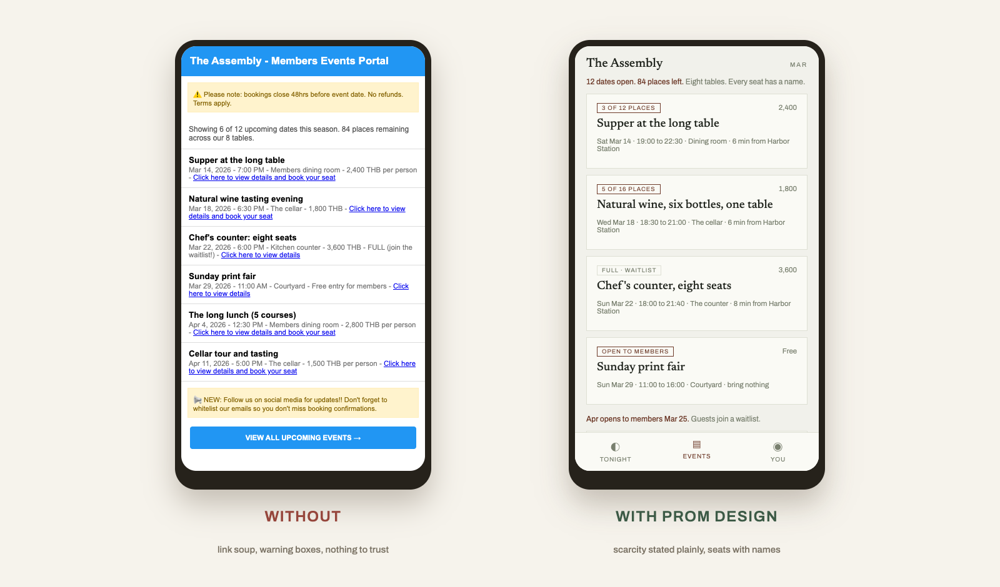</div>

**And the pattern library itself, live.** Every signature component rendered
and interactive, from the proof strip to the coach overlay:
**[components.html](https://sva-admin.github.io/sv-academy-prom-design/demo/components.html)**

## Why one opinionated style, not a toolkit

Because choice is exactly what a non-designer does not need. Fifty palettes
and a hundred font pairings are homework; one proven aesthetic is a result.
The skill carries two registers and the agent picks by task, so your only
decision is recognizing which page you are making:

| Register | For | Feels like |
|---|---|---|
| **Cinematic** | Landing pages, brands, portfolios | Full-bleed photography, editorial serif, an argument you scroll |
| **Instrument** | Apps, dashboards, booking flows | Dense, quiet, tabular, everything provable at a glance |

The style is opinionated, your content is not: your brand's colors, imagery,
and copy all flow through the same rules, which is why the four demos above
share a spine and still look like four different businesses.

## What is actually in the box

Engineering, not vibes. 12 files, ~2,600 lines of working rules:

| File | What it enforces |
|---|---|
| `SKILL.md` | The thesis, both registers, and the working loop: brief, contract, build, review gate, audit, ship |
| `references/taste.md` | What the style always does, never does, and the expensive lessons behind each rule |
| `references/tokens.md` + `assets/tokens-starter.css` | Two shipped token systems, drop-in ready |
| `references/patterns.md` | Signature components with the measurements that make them work |
| `references/copy.md` | Proof-over-promise copywriting: evidence beside every claim |
| `references/imagery.md` | Real photography rules: specific place, season, hour, honest labels |
| `references/webapp.md` | The mobile playbook: density budget, bottom tab bar, compaction |
| `references/audit.md` | The multi-lens audit that rejects slop before a client sees it |
| `scripts/shots.mjs` | Review gate: every route, three widths, screenshots plus defect metrics |
| `scripts/design-audit.mjs` | Generates a six-agent design audit tuned to your repo |

## Objections, answered honestly

**"Will everything I make look the same?"** Less than now. Every default
agent output already converges on one look, and it is the bad one. Two
registers plus your own brand tokens diverge far more than the purple
gradient ever will. The four demos above are the proof.

**"My MVP does not need design."** Your MVP needs trust, and 75% of that
judgment is visual. A page that looks cheap makes the product underneath it
look cheap. That is the whole reason this skill exists.

**"I cannot judge design."** You do not have to generate taste, only
recognize it. You just did, four times, in the gallery above.

**"What is the catch?"** It is one deliberate aesthetic. If you want an agent
to invent a fresh visual identity from a blank page, use a different skill.
If you want to stop shipping slop today, this is the one.

## Who made this

Built by **Prom** at [SV Academy](https://loop.sv-academy.org), distilled
from the house style a working studio uses on real client sites (the clients
stay private; the fictional brands here carry their lessons). SV Academy
teaches people to build real things with AI, free, at
[loop.sv-academy.org](https://loop.sv-academy.org).

If the skill saved your page from the purple gradient, **star the repo** so
the next person finds it, and send the before/after to one friend who ships
slop. More open skills: [github.com/sva-admin](https://github.com/sva-admin?tab=repositories).

MIT licensed. All example brands are fictional. Landscape and interior
photographs in the demos are Unsplash stock, labelled "demonstration imagery"
on the page itself, exactly as the skill's own honesty rules require.
